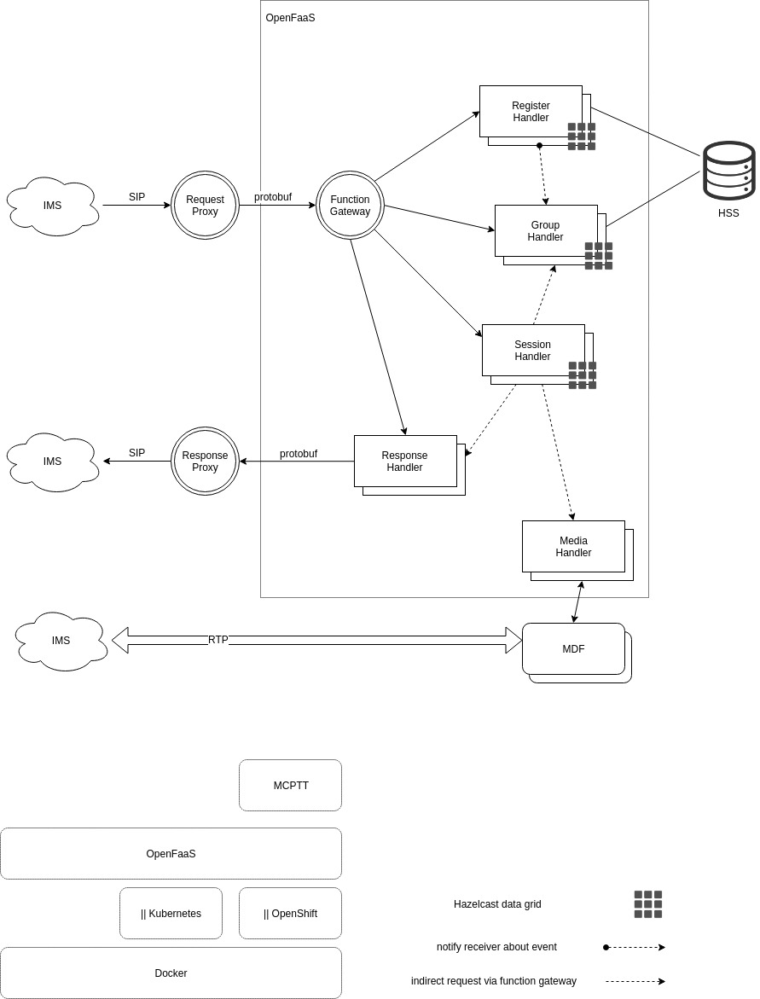

# Serverless Architecture

## Design Consideration

- scaling each component independently.
- developing each component independently, seperate team, framework or programming language
- loosly couple.
- low latency.

## Architecture Overview
In the following architecture we use gateway pattern to seperate internal message format from SIP message format. The `Request Proxy` convert SIP requests to protobuf messages and all internall components work with protobuf messages. Protocol buffer have libraries in many languages so we can use any programming language for each component.

For storing the state we are going to use `Hazelcast` data grid. Hazelcast is an in-memory data grid and have libraries for different programming languages. By using Hazelcast we can create stateless handlers and gain more scalabilty.

## Architecture Components

## Request Proxy
This component receive requests from IMS. After parsing the request it serialized the request to protobuf message and call appropriated function via `Function Gateway`.

## Function Gateway
This components acts as a gateway for available functions in OpenFaaS infrastructure. Read official documents about this component [here](https://github.com/openfaas/faas/tree/master/gateway)

## Register Handler
This component is a depoyed function in OpenFaaS that handles UE registerations. `Function Gateway` call this function on receving REGISTER request from `Request Proxy`.

This component notify `Group Handler` about new user registeration.

## Group Handler
This component is a depoyed function in OpenFaaS that handles user groups. User can create and modify their groups.

## Session Handler
This component is a depoyed function in OpenFaaS that handles MCPTT session. This component get users in a given group from `Group Handler` and invite them to an MCPTT session.

This component is also responsible for managing MCPTT sessions.

## Response Handler
This component is a depoyed function in OpenFaaS that deliver SIP messages to the `Respose Proxy`. 

## Response Proxy
This component received the respose in protobuf format and convert it to appropriated SIP reponse and deliver the message to the IMS core.

## Media Handler
This component is a depoyed function in OpenFaaS and manage `MDF`.

## MDF
This component receives RTP packet from senders and relay them to other clients.