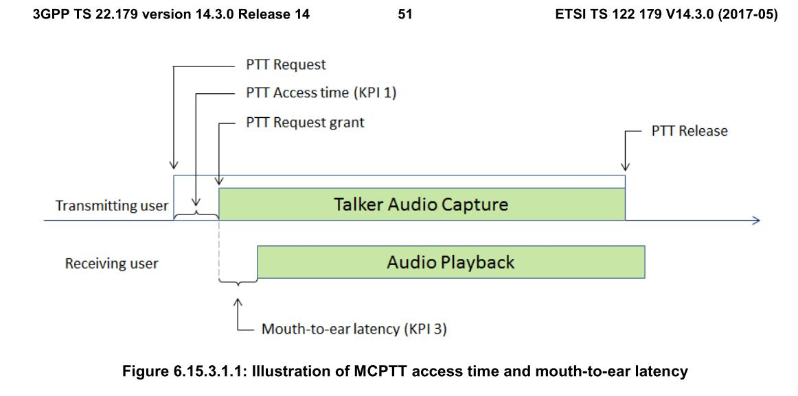

# Serverless Architecture

## Introduction

This document captures the general architecture of the MCPTT app, including design decisions, architecture overview, and a brief overview to each architectural component.

There are various scenarios for a push-to-talk (PTT) application, as specified by ETSI in **3GPP TS 23.379 version 14.7.0**. The most useful scenarios are: 

- Group calls (as specified in subclause 10.6.2.3 and subclause 10.6.2.4);
- Private calls (as specified in subclause 10.7.2.2 and subclause 10.7.2.3);
- MCPTT emergency group calls (as specified in subclause 10.6.2.6.1);
- MCPTT imminent peril group calls (as specified in subclause 10.6.2.6.2);
- MCPTT emergency private calls (as specified in subclause 10.7.2.4); and
- MCPTT emergency alerts (as specified in subclause 10.6.2.6.3).

## Architecture Evolution History

We started with Rust to have both high performance and memory safety, as Rust is known to have a strict type-system that mitigates many programming bugs that lead to memory vulnerabilities in languages such as C/C++. For lower response time in accessing the data, we needed an in-memory data grid. Due to lack of any enterprise-grade library of in-memory data grids for Rust, we moved to C/C++. Other languages were not chosen because of C/C++'s performance superiority. **TODO**: maybe we need a more solid argument on choosing C.

Based on a false comparison between Hazelcast's and Apache Ignite's performance, we moved on with Hazelcast. However, we realized later the falseness of the comparison based on https://www.gridgain.com/resources/blog/gridgain-confirms-apache-ignite-performance-2x-faster-hazelcast and https://dzone.com/articles/benchmarking-data-grids-apache. **TODO**: Apache Ignite vs. Hazelcase comparison table.

To have individual component scalability, loose coupling among components, and component reusability, we chose OpenFaaS as a function as a service platform. **TODO**: complete the following table to compare OpenFaaS vs. Google RPC vs. Containerization

| Solution        | OpenFaaS                 | Google RPC  | Containerization (coarser-grained than function-level decomposition) |
| :------------- |:-------------| :-----| :-----|
| Performance (function call overhead)++ | 1-10 ms **TODO**: what determines if it's 1, 10, or something in between? | 26 us | ? |
| Scalability  | Function with high load will automatically be replicated to distribute the load.      |   Individual function's scalability not possible (**TODO**: possible via look-ahead load balancer?) | ? |
| Readily compatible with K8s? | Yes      |    ? | ? |
| **what else?** | ?      |    ? | ? |

++ : The measured performance is on a single machine (underlying network's latency is not impacting the reported number).

**TODO**: frequently update this section as we move on.

## Design Constraints

The timing for mission-critical systems is defined in section **6.15** of **3GPP TS 22.179 version 14.3.0**. There are two main KPI in that document, one for PTT access time (KPI 1) and other for mouth-to-ear latency (KPI 3). 
The MCPTT Access time (KPI 1) is defined as the time between when an MCPTT User request to speak (normally by pressing the MCPTT control on the MCPTT UE) and when this user gets a signal to start speaking. This time does not include confirmations from receiving users. The Mouth-to-ear latency (KPI 3) is the time between an utterance by the transmitting user, and the playback of the utterance at the receiving user's speaker. The following figure illustrates the KPI 1 and KPI 3.

Therefore we need a fast, scalable, and responsive design. The following design considerations are introduced to address the aforementioned KPIs.

## Design Consideration

- scaling each component independently. --> microservice architectural pattern is used to address this constraint.
- developing each component independently, seperate team, framework or programming language --> microservice
- loosly couple. --> ingress and egress proxies are used to make the internal components independent of the protocol, which is currently SIP.
- low latency.
- high availability --> **TODO**: any pattern other than microservice arch used to address this concern?
- fault-tolerance --> **TODO**: any pattern other than microservice arch used to address this concern?

Companies like Ericsson are also moving towards microservice architecture to implement network functions: https://www.ericsson.com/en/blog/2019/1/are-cloud-native-design-really-needed-in-telecom?utm_source=twitter&utm_medium=social_organic&utm_campaign=BDGS_Cloud_native_design_podcast_Global_11012019&utm_content=&hootPostID=8d345465e6872464434b4507a7369714

## Architecture Overview
In the following architecture we use gateway pattern to seperate internal message format from SIP message format. The `Request Proxy` convert SIP requests to protobuf messages and all internall components work with protobuf messages. Protocol buffer have libraries in many languages so we can use any programming language for each component.

For storing the state we are going to use `Hazelcast` data grid. Hazelcast is an in-memory data grid and have libraries for different programming languages. By using Hazelcast we can create stateless handlers and gain more scalabilty.

An overview to the MCPTT app's architecture is depicted in the figure below. It runs on top of OpenFaaS.

The MCPTT box in the figure above can be further broken down into the components depicted in the following figure.

In general, for the MCPTT to work correctly, several communication links with various internal components of the IMS network may be needed. In the above diagram, HSS is a representative of such components. Hence, communication with other components may also be required that is not depicted in the figure.

In order to focus on the implementation instead of handling messages we are going to use OpenFaaS. OpenFaaS uses [nats.io](nats.io) 
to minimize the message passing overhead. According to the [developer tweet](https://twitter.com/alexellisuk/status/1082592779652554752) function calls in OpenFaaS has 1 to 10 ms delay in processing and relaying a message, depending on the language and run-time used.

## Architecture Components

## Why OpenFaaS and in-memory data grid?

Using [microservice architecture is a trend in telecom industries](https://www.kau.se/files/2017-11/Migrating%20a%20monolithic%20Telecom%20Application%20to%20Microservice%20Architecture%20on%20Google%20Kubernetes.pdf).

There exists two type of services In a microservice architecture, stateful and stateless services. In order to support high availability we store states in external storage, in-memory data grid. We counld't use persistent storage because we require low latency access to the data.

In order to developing manageable and scalable services we are going to use Function as a Service. OpenFaaS is the most popular FaaS implementation.

## Request Proxy
This component receive requests from IMS. After parsing the request it serialized the request to protobuf message and call appropriated function via `Function Gateway`.

## Function Gateway
This components acts as a gateway for available functions in OpenFaaS infrastructure. Read official documents about this component [here](https://github.com/openfaas/faas/tree/master/gateway)

**TODO**: elaborate the following: any function needs to be called via Function Gateway, as required by OpenFaaS. Therefore there's an arrow from Function Gateway to all other components (why not Media Handler??). the dashed arrow denotes that a component needs to call another's component's functions indirectly via Function Gateway.

## Register Handler
This component is a depoyed function in OpenFaaS that handles UE registerations. `Function Gateway` call this function on receving REGISTER request from `Request Proxy`.

This component notify `Group Handler` about new user registeration.

## Group Handler
This component is a deployed function in OpenFaaS that handles user groups; that is, groups of people that want to have a PTT session with each other. User can create and modify their groups.

## Session Handler
This component is a depoyed function in OpenFaaS that handles MCPTT session. This component get users in a given group from `Group Handler` and invite them to an MCPTT session. The session consists of the people from a Group, that are currently available and have already joined the PTT session (a Session is a subset of Group).

Session Handler calls Group Handler functions indirectly by asking Function Gateway for an interface to the requested functions.

This component is also responsible for managing MCPTT sessions.

## Response Handler
This component is a depoyed function in OpenFaaS that delivers protobuf messages to the `Respose Proxy`. 

## Response Proxy
This component received the respose in protobuf format and convert it to appropriated SIP reponse and deliver the message to the IMS core.

## Media Handler
This component is a depoyed function in OpenFaaS and manage `MDF`.

## MDF
This component receives RTP packet from senders and relay them to other clients. Because this component should handle many RTP streams we couldn't encapsulate this component as a function in OpenFaaS. OpenFaaS functions are docker images that contain binaries with predefined input and output ports.
