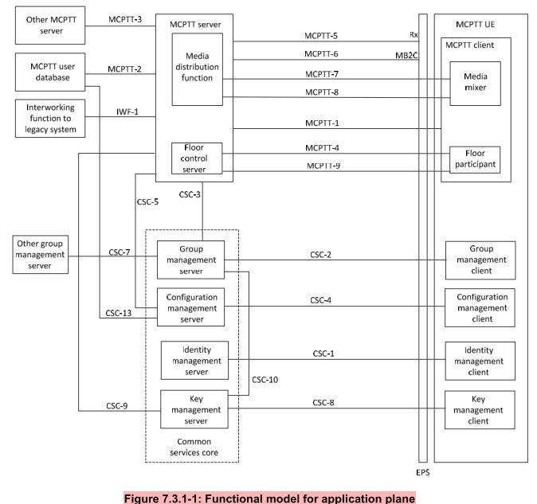
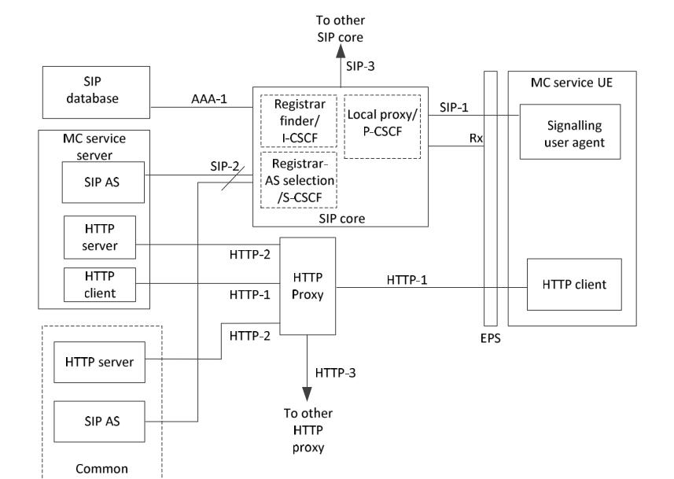
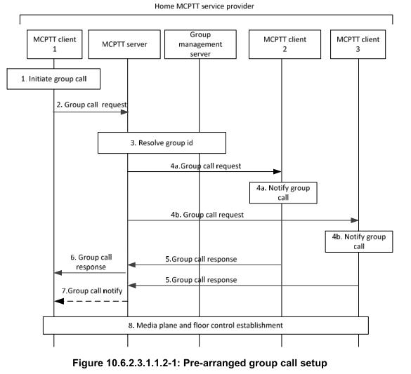

| Author  | Version  |  Date |  Changes |   |
|:-:|:-:|:-:|:-:|:-:|
| Ali Shirvani  |  0.1 | November 11, 2018  |  init commit |   |

# MCPTT 1:1 task list

In this document we enumerate steps toward producing simple walkie-talkie system. The system architecture is based on the architecture that described in section 7.3 of **TS 23.179**.

Here is the application plane:

Following shows signaling plane architecture:

In order to implement complete MCPTT service we break down the project in to smaller parts. Current document describe the main features for simple one to one MCPTT call.

In this document we try to specify the main components of MCPTT service and try to implement minimal functional subset of specifications, for other components and their procedures refer to:

<!-- TS 24.379 page 30 -->

- The **floor-control** procedures defined in **3GPP TS 24.380**.

- The **group management** procedures defined in **3GPP TS 24.481**.

- The **identity management** procedures defined in **3GPP TS 24.482**.

- The **security** procedures defined in **3GPP TS 33.180**.

- The **PS-PS access transfer** procedures procedures defined in **3GPP TS 24.237**.

- **Codecs and media handling** for MCPTT are specified in **3GPP TS 26.179**.

Current task list organized in the following manner: 
first section describes list of tasks related to implementing simple messaging service. The second section describes task for handling SIP requests. The third section describes simple load test with `sipp`. The forth section describes transferring simple media file between peers and the last section describes integrating all previous part to simple 1:1 MCPTT service that supports two clients.

## Simple Messaging Service
According to section 10.6.2.3 in **TS 23.379** MCPTT clients could initiate group call by sending group call request to MCPTT server. Following is the signaling steps of pre-arranged group call:

As shown in the figure the MCPTT server should receive request from client, process the request and then transmit some other request to other clients. So the MCPTT server should do some messaging tasks.

Here is the list of tasks that MCPTT server should do:

1. Receive request from one client
2. Process request
3. Transmit new requests to other clients

**NOTE**: Request is simple text message in this section, in the next section we handle SIP requests.

## Handling SIP Requests
In the previous section we described simple messaging service required by MCPTT service. In this section we describe more realistic scenario.

In the real MCPTT service, the server should handle SIP request among many other type of request.

According to **TS 24.379** for on-network calls MCPTT service make use of the existing IMS procedures specified in **TS 24.299**.

According to **TS 24.379** section 8 and 10 the MCPTT service should provide following functionalities:

1. Handling SIP REGISTER request.
2. Simple SIP client such as `baresip` should register with the MCPTT server.
3. Routing 1:1 call signaling without floor control and authentication.

## Load Test

In this milestone we should test the implementation under different conditions. We can use `sipp` for load tests.

## Transfer Media 
In this milestone with should transfer media between peers via RTP and RTCP protocols.

Peers are simple SIP clients such as `baresip`. The MCPTT server should replicate received RTP packets from one cleint to the other.

In this milestone MCPTT server doesn't support any transcoding.

## Integration
In this milestone we should integrate all previous parts to implement simple MCTPP server that handle MCPTT client registration and could establish 1:1 call between peers.

# Deliverables
 - Simple SIP protocol parser
 - Async and concurrent messaging service
 - RTP and RTCP replicator
